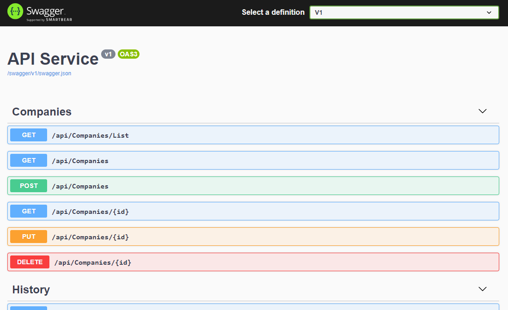
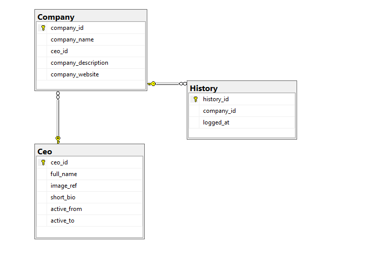

# .NET Core Web API service - "Who's the CEO"
API Web service providing information about public companies and their CEO's.  
This application acts as the backend implementation of [whostheceo-vue-app](https://github.com/michelnickbon/whostheceo-vue-app).

# Information
- .Net Core 3.1 Web API
- Entity Framework
- SQL Server 2019
- xUnit

# Preview

# Database schema
